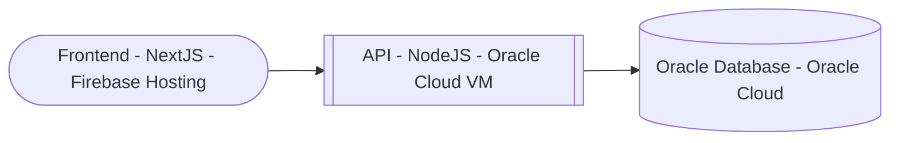

# Gestión de Ventas – Oracle Cloud

Backend principal del sistema de **gestión de ventas y vendedores**, con conexión directa a una base de datos **Oracle PL/SQL alojada en Oracle Cloud**.  
Despliegue completo sobre infraestructura **cloud híbrida**: frontend alojado en **Firebase Hosting** y backend en **VM Ubuntu (Oracle Cloud)**, gestionado mediante **PM2** y **Cloudflare Tunnel**.

---

## Demo y Acceso

**Frontend en línea:** [oracle-dashboard.0003333.xyz](https://oracle-dashboard.0003333.xyz)  
**API Backend:** [api.0003333.xyz](https://api.0003333.xyz)

---

## Repositorios Relacionados

- [Frontend (Next.js)](https://github.com/alex3373/Frontend_Gestion_BBDD)
- [Base de datos PL/SQL](https://github.com/alex3373/BBDD_SQL-PLSQL)

---

## Tecnologías Utilizadas

| Capa | Tecnología |
|------|-------------|
| Backend | Node.js, Express |
| Base de Datos | Oracle Database 21c (PL/SQL, triggers, procedimientos) |
| Infraestructura | Oracle Cloud VM (Ubuntu 22.04), PM2, Cloudflare Tunnel |
| Integración | REST API, conexión oracledb |
| Frontend | Next.js (alojado en Firebase Hosting) |

---

---

## 🧱 Arquitectura General

---

## 👨‍💻 Autor

**Alexis Córdova Díaz**  
Analista Programador | Desarrollador Full Stack  
📧 alexisandres311@gmail.com  
🌐 [linkedin.com/in/alexis-andres-cordova](https://linkedin.com/in/alexis-andres-cordova)

---

